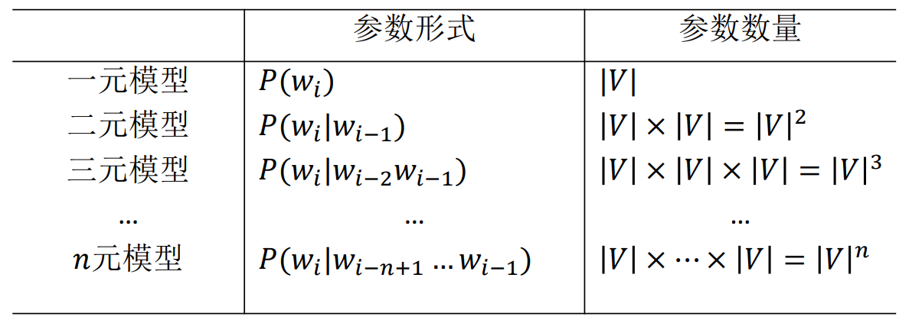
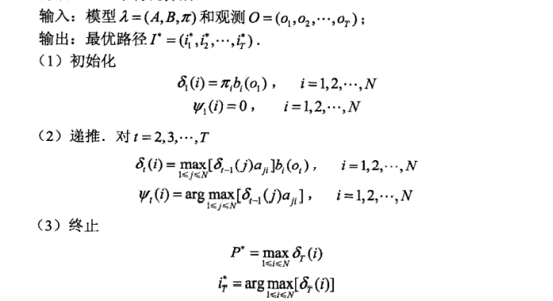

### 实验目的

中文分词指的是中文在基本文法上有其特殊性而存在的分词。中文分词是自然语言处理中文部分的基础，很多下游任务都需要基于分词的基础进行，分词的质量也一定程度上决定了下游任务的准确性。本次实验拟通过传统算法，在中文数据集PKU 与 MSR上实现中分分词模型。主要的实验目的包括：

- 了解中文分词（Tokenization）任务的基本解决思路。
- 学习自然语言处理数据集的处理与词表的构建方法。
- 借助传统的语言模型与算法实现中文分词。掌握N-gram语言模型和隐马尔科夫链等模型的基本思想和算法实现。
- 掌握评价中分分词好坏的评价指标。
- 学会分析Bad Case以及产生的原因，并尝试寻找解决的思路与办法。

### 实验原理

#### N-Gram模型

N-gram是自然语言处理中常见一种基于统计的语言模型。它的基本思想是将文本里面的内容按照字节进行大小为N的滑动窗口操作，形成了长度是N的字节片段序列。每一个字节片段称为gram，在所给语句中对所有的gram出现的频数进行统计。再根据整体语料库中每个gram出现的频数进行比对可以得到所给语句中每个gram出现的概率。N-gram在判断句子合理性、句子相似度比较、分词等方面有突出的表现。

N-gram模型的本质是一个N-1阶的马尔可夫链，所以隐含了一个假设，即马尔科夫假设：第n个词出现与前n-1个词相关，而与其他任何词不相关。整个句子出现的概率就等于各个词出现概率的乘积。各个词的概率通过语料中的统计计算得到。

N元模型的主要参数就是N的选取，该参数的不同带来的差异是模型参数量的变化和计算消耗资源的变化，如下图所示：

其中V代表词库的大小，𝑛越大，模型需要的参数越多，参数数量指数增长。𝑛的选择一般根据以下特点来判断：

- 𝑛较大时，提供了更多的语境信息，语境更具区别性；参数个数多、计算代价大、训练语料需要多、参数估计不可靠。 

- 𝑛较小时，语境信息少，不具区别性；但是，参数个数少、计算代价小、训练语料无需太多、参数估计可靠。 

#### HMM模型

隐马尔可夫模型( hidden Markov model, HMM)是可用于标注问题的统计学习模型，描述由隐藏的马尔可夫链随机生成观测序列的过程，属于生成模型。

隐马尔可夫模型是关于时序的概率模型，描述由一个隐藏的马尔可夫链随机生成不可观测的状态随机序列，再由各个状态生成一个观测而产生观测随机序列的过程。隐藏的马尔可夫链随机生成的状态的序列，称为状态序列（state sequence）;每个状态生成一个观测，而由此产生的观测的随机序列，称为观测序列（observation sequence）。序列的每一个位置又可以看作是一个时刻。

HMM模型有三类问题，分别有对应的算法去解决。

- 对于概率计算问题，可以使用前向算法和后向算法来解决，其本质是动态规划的思想，能够比暴力穷举的指数级复杂度优化很多。

- 对于学习问题，针对无监督的学习，有Baum-Welch算法来学习HMM模型的参数。当然，有监督的学习一般会比无监督的学习效果好一些，对于没有标注的文本处理，可以使用Baum-Welch算法。对于标注的数据集，则可以直接是用极大似然函数估计模型的参数。本文实验所有的数据集是分号词的数据集，因此并不需要Baum-Welch算法分词计算。

- 对于编码问题，采用经典的维特比算法，该算法根据观察序列来求解概率最大的状态序列。具体算法如下图所示：

除此之外，有指导的学习和无指导的学习存在一些差异和特点，这里单独拿出来对比：

- 有指导的参数学习(supervised learning)，参数学习简单，效果好；但是状态信息未知时无法使用，或需要人工标注状态信息，代价高；在NLP中，无指导学习效果不佳时，采用有指导学习。

- 无指导的参数学习(unsupervised learning)，在模型(𝜆)未知的情况下，如果仅给定观察序列，此时学习模型的方法被称做无指导的学习方法。对于隐马尔科夫模型而言，采用无指导学习方法，没有解析方法。首先给定一组不准确的参数，再通过反复迭代逐步求精的方式调整模型参数，最终使参数稳定在一个可以接受的精度。利用无指导学习方法估计隐马尔科夫模型参数，不能保证求得最优模型，能保证得到局部最优模型。

### 实验方案

#### N-Gram模型分词

在前面的原理中我们知道N的取值影响会模型的而参数影响十分大，呈现指数级增长。这里我考虑实验设备的局限性，由于没有GPU，为了防止模型参数过大，这里我们使用Uni-Gram模型进行建模，即N=1，此时，模型参数个数少、计算代价小、训练语料无需太多、参数估计可靠。并且观察到给定的数据集也不是很庞大，很适合这种训练语料不多的情况。因此，本次实验采用Uni-gram模型进行实验。

由于数据集中每一行是一段长句，每个长句中有很多标点，有些标点会把长句分割称一段段短句。因此需要一些预处理操作。下面是Uni-gram模型中文分词的基本步骤：

1. 首先分别对PKU与MSR数据集依据空格分词进行词频统计，构建词表，词表的Key是词语，Value是这个单词在语料中出现的次数，构建的词表称作Vocab_Dict。

2. 对句子能够产生字句的标点进行统计，包括：“——”, “、”, “，”, “。”, “！”, “：”。这些符号是产生子句的标志。

3. 考虑到数据稀疏的问题，直接进行参数估计可能效果很不好，因此需要对数据做平滑操作，这里采用简单的“加1”平滑。(注：我们知道，NLP中，“加1”平滑，给训练语料中没有出现过的𝑛元组分配了太多的概率空间。但是情况是针对词库很大，尤其是N-gram中N比较大时不适合使用，本次实验的数据集的词表字典都在1万词一下，只有几千，因此使用“加1”平滑并不会产生太大影响)

4. 而根据词表构建的概率分布即是Uni-gram模型的参数。

5. 对于新输入的没有分词的语句，将其根据标点分好的短句。采用动态规划思路遍历句子中每个子序列，记录概率最大的位置进行切词。同时这里计算概率后进行**求对数**，主要是防止某些句子过长产生浮点溢出问题。

6. 对一些特殊的表达规则进行匹配，增加一些通用用语的分词准确率，例如表示日期，数量等词语规则进行单独处理，提高分词的精度。

7. 对测试数据进行分词，通过准确率，召回率和F1分数来评估模型的性能。

#### 隐马尔科夫链模型分词

隐马尔可夫模型针对中文分词任务的建模比较特殊。一般观测序列即要分词的语料，状态序列由四个标签组成：“S”（Single）表示单个字作为词；“B”（Begin）表示一个词语的开始第一个字；“E”（End）表示一个词语结尾最后一个字；“M”（Middle）表示一个单词中间的那些字。这样“S”，“B”，“E”，“M”组成了状态序列的符号集合；而观测序列的符号集合即语料库中的字的集合。这样就建立了状态集合S和观测集合V。我们要构建的模型即估计出HMM模型的状态转移矩阵A，状态输出矩阵B和状态初始概率Pi即可。

基于HMM模型的中文分词步骤如下：

1. 由于HMM模型是在字符层面标识，首先需要针对PKU和MSR数据集遍历每个以空格切分的单词，根据单词的特性，为每个单词中的字符打上状态标签，即“S”，“B”，“E”或“M”。构建出打上标签的序列，形如：[[('你','B'),..],[..],..]。

2. 根据步骤1获取的语料标签序列构建索引字典，包括状态集合与其索引相互转换的字典，观测集合与其索引相互转化的字典。这样将字符与数字建立了联系，后续可以用矩阵下标表示查找相对应的字符。注意这里构建观测序列字典的时候需要加入未登录词的标识，增加一个“unk”的字符索引，默认索引设置为0。

3. 构建完词表和索引字典后，需要依据极大似然估计估计HMM的初始化参数Pi，转移概率矩阵A和输出概率矩阵B。具体估计方法如下：
   - 对于初始化参数Pi：统计每个句子开头第一个字符的状态标签个数，再通过“加1”平滑，最后除以每个状态标签计数的总和，得到初始化的概率向量Pi。
   - 对于转移矩阵A：统计每个句子前一个字符到后一个字符对应的状态标签变化，将他们计数存入转移矩阵对应的位置上，再通过加一平滑，最后除以每一行（或每一列）对应的总和来归一化转移概率。
   - 对于输出概率矩阵B：统计每个字符对应的状态序列到该字符的变化，将他们存入B矩阵对应的位置，再通过加一平滑，最后除以每一行（或每一列）对应的总和来归一化转移概率。
   - 注意：Pi，A和B矩阵在统计前都是初始化为全0的矩阵。

4. 根据得到的HMM模型参数实现维特比算法，算法的原理参考实验原理部分的介绍。根据维特比算法，这样我们给定一个没有分词的句子，可以获取对应的状态序列，即由“S”，“B”，“E”或“M”四类字符组成的序列，然后根据“S”和“E”以及句子结尾作为分词位置的依据。最后得到分词后的句子，以空格分词即可。

5. 对整个测试数据进行分词，然后根据准确率，召回率，和F1分数进行评估。

### 实验结果

#### PKU数据集

实验评价指标主要针对准确率，召回率，F1分数以及处理速度进行评估。在PKU数据集上的模型的几大评价指标如下表所示：

| 模型          | 准确率 | 召回率 | F1分数 | 速度（字/s） |
| ------------- | ------ | ------ | ------ | ------------ |
| Uni-Gram      | 0.8550 | 0.9342 | 0.8928 | 78447        |
| Uni-Gram+规则 | 0.9111 | 0.9496 | 0.9300 | 14686        |
| HMM           | 0.7936 | 0.8090 | 0.8012 | 34757        |

注意，这里的规则指的是通过匹配到一些特殊的字，如“年”，“月”，“日”等字同时前面是数字，那么就将这些数字和关键字组合为一个词语。或者是“万”，“亿”等表示数量的词做相似的处理等。也就是通过人为加规则的方法来实现。

#### MSR数据集

实验评价指标与上述相同，主要针对准确率，召回率，F1分数以及处理速度进行评估。在MSR数据集上的模型的几大评价指标如下表所示：

| 模型          | 准确率 | 召回率 | F1分数 | 速度（字/s） |
| ------------- | ------ | ------ | ------ | ------------ |
| Uni-Gram      | 0.9119 | 0.9633 | 0.9369 | 138870       |
| Uni-Gram+规则 | 0.9129 | 0.9634 | 0.9375 | 33518        |
| HMM           | 0.7786 | 0.8189 | 0.7983 | 36548        |

### 实验分析

从实验结果来看，在PKU数据集上，Unigram加规则的效果最好，但是处理速度最慢；其次是Unigram不加规则，处理速度同时也是最快的；最后是HMM模型，处理速度中等。

但在MSR模型中，Unigram加规则的效果仅比不加规则好一点点，但是速度相比慢很多，侧面反映出MSR测试集以及训练集中的日期和量词等规则的字词不多，通过观察测试集合中的句子，也确实几乎没有什么符合规则的字词，几乎都是一些文学描述。但是HMM的表现效果依旧不是很好。

综合结果来看，隐式马尔可夫模型的表现较差。不管是精确率，召回率还是 F1值都显著低于Unigram模型。经过分析，我们认为可能有以下几个原因： 

1. 隐式马尔可夫模型是基于字标注的模型，它没能很好的利用词典的信息进行标注。

2. 隐式马尔可夫模型对于其输出矩阵，转移矩阵，初始矩阵的空值较为敏感，简单的平滑处理不能很好的体现真实情况。

3. 训练语料与测试中的句子长度也可能是其表现较差的原因。

对于PKU数据集中的大量日期量词出现，通过加规则的方式能够很大程度上提升分词的准确性，但是低于MSR这种几乎没有这样特征的数据集就没有必要添加规则，对于精度的提升没有多少。